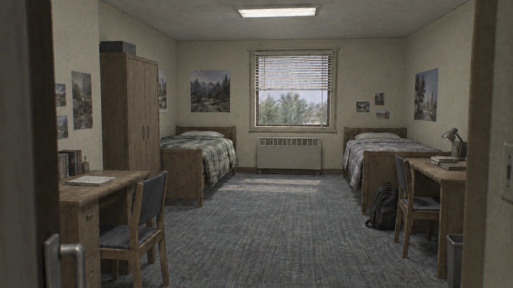
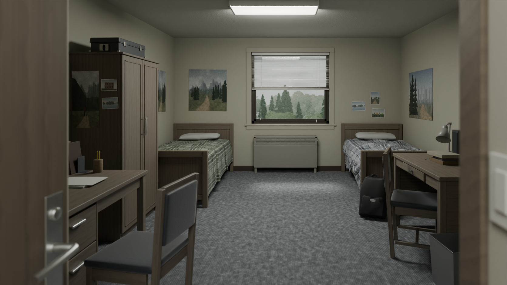

# Dorm Room — 3D reconstruction (Blender 5.2 / Cycles)

A real, editable 3D reconstruction of the supplied reference photo of an American
college double dorm room. Everything is generated by Python scripts. There are no
downloaded assets: geometry, PBR materials, bedding drape, textures and lighting
are all built procedurally, so the scene can be rebuilt and tweaked from source.

| Reference | Final render (`renders/render_04_final.png`) |
|---|---|
|  |  |

## Deliverables

| File | What it is |
|---|---|
| `dorm_room.blend` | Final editable scene (Blender 5.2, Cycles). All textures packed. Active camera `Camera_Ref` matches the reference; `Camera_Alt` is a verification view. |
| `renders/render_04_final.png` | **Final render**, 1672×941 (reference resolution), Cycles 256 spp adaptive + OpenImageDenoise, ~22 min on 4 CPU cores. |
| `renders/render_01.png` … `render_03.png` | Earlier iterations from the critique / refinement loop. |
| `renders/compare_*_sbs.jpg` | Reference (left) vs render (right) for every iteration. `compare_04_final_edges.jpg` overlays reference edges (red) on render edges (cyan); `compare_04_final_blend.jpg` is a 50/50 mix. |
| `renders/alt_view.png` | Render from `Camera_Alt`, looking back at the door, to show the room is true 3D. |
| `scripts/` | Build pipeline (see below). |
| `textures/` | Generated image textures (posters, photos, plaid weave, exterior backplate). |

## Rebuilding

```bash
pip install bpy==5.2.2 pillow          # Blender-as-a-Python-module
python scripts/gen_textures.py textures                 # posters, plaid, exterior backplate
python scripts/build_scene.py dorm_room.blend           # geometry, cloth sim, materials, lights, camera
python scripts/add_alt_camera.py dorm_room.blend        # optional verification camera
python scripts/render.py dorm_room.blend renders/final.png --samples 256 --threshold 0.02
python scripts/compare.py renders/reference.png renders/final.png renders/compare
```

`build_scene.py --no-cloth` skips the blanket simulation for fast layout iteration.

## Camera match

The reference is a one-point perspective with vertical verticals (no pitch or roll),
so the camera looks straight down +Y and the off-centre vanishing point is produced
with lens shift rather than rotation.

* **Vanishing point** ≈ (942, 323) px, from the intersection of the two long
  ceiling/side-wall edges (the most reliable lines in the image).
* **Back-wall scale**: the back wall spans 575–1322 px horizontally and 126–565 px
  vertically. With a 2.45 m ceiling that gives 179 px/m, a 4.17 m wide room, a
  camera 2.05 m from the left wall, and an eye height of 1.35 m.
* **Focal length** came from the beds. The footboards project at ~1.5× the
  back-wall scale, so with a 2.1 m bed frame the back wall is ~6.2 m from the
  camera, which works out to 24 mm on a 36 mm sensor.
* Lens shift −0.0634 / −0.0882. DOF focused at 4.2 m, f/2.8, which reproduces
  the soft near door and jamb.
* Cross-checks that landed without being tuned: the light switch on the vestibule
  wall comes out at a standard 1.2 m height, and the heater, window casing, posters
  and both headboards fall on the reference edges (see `renders/compare_*_edges.png`).

The camera stands in a short entry vestibule (0.66 m behind the room's front wall).
The dark blurred slab on the left is the room door, swung 90° inward against the
vestibule wall. The right-hand band is the vestibule wall with its light switch and
the stained casing of the cased opening.

## Major modeling decisions

* **Units and layout.** The room is 4.17 × 5.56 × 2.45 m with a 1.0 m wide
  entry vestibule. Every object is real geometry at real-world scale, bevelled so
  edges catch light. Furniture is grouped under named empties (`Bed_Left`,
  `Wardrobe`, `Desk_Right`, `Chair_Left`, …) and sorted into collections
  (Architecture, Window, Beds, Furniture, Props, Decor, Lights, Camera, Exterior),
  so each element can be moved or edited independently.
* **Physically consistent where the reference is not.** The reference is
  internally inconsistent: its wardrobe would be ~25 cm deep and intersect the
  left bed, and both desks would be ~0.95 m deep. I used real furniture
  dimensions instead (wardrobe 0.52 × 0.90 × 1.78 m, desks 0.80 m deep) and
  placed them so the silhouettes land where the reference has them. One knock-on
  effect is that the wardrobe's camera-facing side now covers the stretch of
  left wall that holds posters in the reference, so those posters are taped to
  the wardrobe side instead. That keeps the "posters left of the wardrobe"
  composition.
* **Beds and bedding.** Each bed has a wooden panel frame (posts, rails, panels,
  side rails, deck) and a rounded mattress. The blankets are **cloth-simulated**:
  a 2.5 cm grid with self-collision draped over the mattress and frame, with the
  floor and walls as colliders. Three tricks make it read as a real comforter
  rather than a sheet:
  1. A soft *pin* vertex group over the mattress top, fading to zero at the edges,
     so the heavy overhang can't drag the blanket off the bed.
  2. Negative cloth *shrink* (rest length ~7% longer than placed), so the fabric
     buckles into natural folds along the drape.
  3. Seeded soft folds plus a slight random rotation, then 2.8 cm solidify and
     subdivision for comforter thickness.

  The pillows are procedural: a puffy top, a flattened bottom resting on the
  blanket (placed by ray-cast), a bulging outline, pinched corners and seam
  wrinkles.
* **Right bed** is rotated 2.7° about its head corner, as in the reference, where
  the right bed sits slightly askew. That avoids a too-tidy symmetric layout.
* **Window.** Real wall opening with a drywall return, painted casing, stool and
  apron, a dark bronze single-hung frame with meeting rail and sash lock, and
  glass. The 30 blind slats are instances of one curved-profile mesh with
  randomised tilt; a couple are knocked askew. There are ladder strings, two lift
  cords with tassels, and a tilt wand.
* **Exterior.** A backplate card 7 m outside the window, carrying a procedurally
  painted overcast tree view (feathery conifers rising over leafy canopy). It is
  visible to camera and glossy rays only, so it never blocks or colours the
  daylight.
* **Materials.** All PBR in Cycles: base colour + roughness variation + bump on
  every surface, with real-world-scaled procedural detail:
  * wood: ring/fibre grain whose direction is set per part via an object custom
    property, AO grime in crevices, thin clear coat
  * walls: eggshell latex with mottling, sand grain, orange-peel bump, AO corner
    grime and floor-level scuffs
  * ceiling: stipple
  * carpet: loop pile with tufted rows, flecks, traffic mottling
  * blankets: plaid weave image with brushed-flannel bump
  * also enamel, brushed steel, nylon, paper, translucent vinyl slats, and glass
    that passes shadow rays

## Lighting

Only physically motivated sources:

1. **Overcast daylight.** A world sky with a CIE-overcast-like gradient (zenith ~3×
   horizon) through a Cycles **portal** in the window, plus a hazy sun (12° disc)
   behind the window. Together they give the soft light pool on the carpet in
   front of the heater and backlight the blinds.
2. **Ceiling fixture.** A surface-mounted wraparound fluorescent. The lens is
   emissive, there is a downward area light under it, and two thin side-emission
   strips light the ceiling, cool-white with a slight green tint.
3. **Entry lights.** A dim ceiling light inside the entry vestibule, and the
   corridor fixture beyond the open door. Together they lift the foreground
   door side.

No fill or rim lights. Colour management is AgX (Base Contrast), exposure +0.12.

## Critique / refinement log

Each render was compared against the reference with `scripts/compare.py`, which
produces side-by-side, 50/50 blend and edge overlays, plus per-region colour
statistics. The five largest differences were ranked by visual impact, and the
highest-impact ones were fixed before rendering again.

### Render 1 → ranked differences
1. **Global tone.** The foreground and left side were far too dark (luma 38–55
   vs 65–77) and contrast too high. The warm fixture light pushed the walls pink,
   where the reference looks neutral-green fluorescent.
2. **Carpet.** It read as a flat charcoal plane. The cause was a Sheen 0.8 lobe
   glowing at grazing angles, plus texture detail finer than a pixel. The
   reference is a coarse blue-grey loop pile.
3. **Bedding.** The blankets read as thin, pale, tight sheets with the plaid
   washed out, again by fabric sheen.
4. **Surface ageing.** Walls were clean, smooth paint; wood was dark, uniform
   reddish laminate.
5. **Window.** Overlapping trim volumes made dark squares at the casing corners;
   the blinds and exterior were dull.

**Fixes:**
* Moved fixture energy from the downlight into lens side-glow, made the lights a
  cooler fluorescent tint, added a vestibule light, and raised daylight.
* Rebuilt the carpet at centimetre scale (tufts, rows, flecks, traffic mottling)
  with low sheen.
* Fabric sheen 0.8 → 0.15; comforter thickness via solidify; seeded folds.
* Sand-grain plaster albedo and more grime; greyer, weathered oak.
* Non-overlapping casing; brighter blinds; new tree backplate.

### Render 2 → ranked differences
1. **Bedding still too neat.** It draped like a stiff straight skirt, with a
   fine, low-contrast check pattern.
2. **Window view.** It read as pale fog (143–150 vs 123–126). The blinds were too
   dim (164 vs 180).
3. **Light distribution.** The daylight pool on the carpet in front of the heater
   was missing (91 vs 124). The wardrobe side was too dark while its door face
   was overlit.
4. **Fixture and ceiling.** The lens was a clipped white slab; the ceiling had
   too little stipple.
5. **Tint and scale.** The carpet was slightly too blue, and the trunk on the
   wardrobe was oversized.

**Fixes:**
* Cloth: negative *shrink* (fabric buckles into side folds), softer pinning,
  rotation jitter, plaid at 1.6× scale with stronger dark lines.
* A new feathery-conifer / leaf-clump backplate painter, composed for the slice
  of backplate visible through the window.
* Near-horizontal slat tilt, so the camera looks *through* the blinds as in the
  reference.
* A CIE-overcast sky gradient plus a hazy sun at 45° behind the window, which
  produces the floor pool and backlit blinds.
* Dimmer lens, stronger stipple, a smaller trunk, exposure +0.12.

### Render 3 → ranked differences (final polish)
1. Moiré rings on the upholstered chair seats. The sub-millimetre wave-based
   weave bump aliases at viewing distance.
2. The carpet's tufted rows rendered as regular corduroy-like stripes.
3. The lower-window exterior was slightly too dark (105–114 vs 140).
4. The backpack's nylon sheen rim made it read like a soft lunch bag.
5. The wardrobe door face was overlit (116 vs 93).

**Fixes:** noise-only fabric micro-bump, broken-up and weaker carpet rows,
backplate strength 0.78 → 0.95, matte nylon, a slightly darker wardrobe wood.

An alternate-camera check (`renders/alt_view.png`) then exposed two construction
flaws invisible from the hero camera:
* Overlapping vestibule and front-wall volumes caused AO-grime streaks.
* The vestibule opened into a void, with a gap above the corridor door frame.

Both were fixed: trimmed walls, a real corridor wall around the door frame, and
a corridor with its own floor, ceiling and light. The entry light moved inside
the vestibule. This version was rendered as `render_04_final.png`.

Mean colour of the final render is within ~3 levels of the reference
(RGB 84/82/74 vs 83/79/71).

## Remaining weaknesses

* **Wardrobe and left wall.** To keep real furniture depths, the wardrobe is
  deeper than the (physically impossible) reference one. Its dark camera-facing
  side replaces the bright poster wall the reference shows, so the upper-left of
  the frame is darker than the reference.
* **Left desk and chair.** These are larger and closer in frame than in the
  reference. The reference implies a ~0.95 m deep desk, and its chair geometry is
  inconsistent between back posts and seat.
* **Blankets.** They now drape and fold, but read slightly cleaner and more
  uniform than the reference's heavier, lumpier flannel comforters. There's no
  quilting, pilling or tucked-under-mattress behaviour.
* **Exterior.** The backplate is a 2D painting. Through the glass it reads well,
  but it has no parallax for camera moves.
* **Small props.** The backpack, books and wastebasket are clean procedural
  shapes without wear, labels, stitching or printed spines.
* **Wood.** The procedural oak lacks the reference's lighter, sun-faded,
  scuffed edges. There is no per-part edge wear or chipped corners.
* **Posters.** They are procedural paintings, more stylised than the
  reference's illustrated prints.
* **Casing corners.** Where the vestibule's casing face boards meet the head
  casing, they overlap slightly, which leaves two tiny AO specks. They're visible
  only from `Camera_Alt`; trimming the face boards to the head bottom fixes it.
* **Contrast.** It is still slightly higher than the reference (std 36 vs 32).
  The reference has a softer, slightly lifted, AI-photographic tonal curve.

## With one more pass I would…

1. **Bedding:** re-simulate the comforters as a quilted two-layer cloth
   (pressure or internal springs) with a tucked edge at the wall side. Add a
   fitted sheet visible at the foot, and fuzz/pilling via a fine displacement
   texture. That would close the biggest remaining realism gap.
2. **Wood and wear:** pointiness/edge-mask–driven wear (lighter, scuffed edges,
   chipped corners) and a slightly lighter, sun-faded finish on wardrobe and
   desk tops. Unique UV-baked grain per part instead of shared procedural space.
3. **Exterior:** replace the backplate with low-poly 3D trees (particle leaf
   cards) a few metres outside the window, for true parallax and light
   filtering through the canopy.
4. **Props:** a modelled backpack with straps, buckles and stitching; book
   spines with printed titles; more lived-in clutter supported by the reference
   (charger cable, mug).
5. **Grade:** a compositor pass (gentle lifted blacks, a slight green-grey
   shadow tint, subtle vignette and bloom on the window) to bring contrast and
   mood the last few percent toward the reference.
